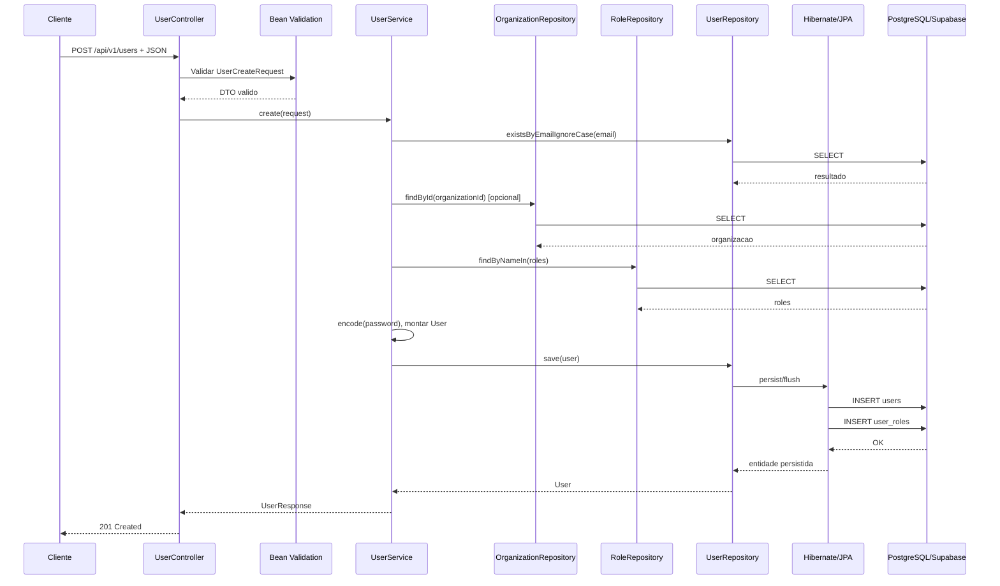

# Fluxo Tecnico - Criacao de Usuario

Este documento descreve tecnicamente o fluxo do endpoint `POST /api/v1/users` no `user-service`, da entrada HTTP ate a persistencia no PostgreSQL do Supabase.

## Objetivo do endpoint

Criar um usuario na tabela `users`, associar uma organizacao opcional, associar uma ou mais roles na tabela `user_roles` e devolver um `UserResponse` para o cliente.

## Arquivos envolvidos

- Controller: [src/main/java/com/lms/userservice/controller/UserController.java](</D:/Projetos/LMS_Learning_Service/User_service/src/main/java/com/lms/userservice/controller/UserController.java>)
- Service: [src/main/java/com/lms/userservice/service/UserService.java](</D:/Projetos/LMS_Learning_Service/User_service/src/main/java/com/lms/userservice/service/UserService.java>)
- DTO de entrada: [src/main/java/com/lms/userservice/dto/UserCreateRequest.java](</D:/Projetos/LMS_Learning_Service/User_service/src/main/java/com/lms/userservice/dto/UserCreateRequest.java>)
- DTO de saida: [src/main/java/com/lms/userservice/dto/UserResponse.java](</D:/Projetos/LMS_Learning_Service/User_service/src/main/java/com/lms/userservice/dto/UserResponse.java>)
- Entidade principal: [src/main/java/com/lms/userservice/entity/User.java](</D:/Projetos/LMS_Learning_Service/User_service/src/main/java/com/lms/userservice/entity/User.java>)
- Repositories:
  - [src/main/java/com/lms/userservice/repository/UserRepository.java](</D:/Projetos/LMS_Learning_Service/User_service/src/main/java/com/lms/userservice/repository/UserRepository.java>)
  - [src/main/java/com/lms/userservice/repository/RoleRepository.java](</D:/Projetos/LMS_Learning_Service/User_service/src/main/java/com/lms/userservice/repository/RoleRepository.java>)
  - [src/main/java/com/lms/userservice/repository/OrganizationRepository.java](</D:/Projetos/LMS_Learning_Service/User_service/src/main/java/com/lms/userservice/repository/OrganizationRepository.java>)
- Tratamento de erros: [src/main/java/com/lms/userservice/exception/GlobalExceptionHandler.java](</D:/Projetos/LMS_Learning_Service/User_service/src/main/java/com/lms/userservice/exception/GlobalExceptionHandler.java>)
- Configuracao de seguranca e encoder: [src/main/java/com/lms/userservice/config/SecurityConfig.java](</D:/Projetos/LMS_Learning_Service/User_service/src/main/java/com/lms/userservice/config/SecurityConfig.java>)

## Contrato HTTP

### Requisicao

Metodo:

- `POST /api/v1/users`

Content-Type:

- `application/json`

Body esperado:

```json
{
  "organizationId": "11111111-1111-1111-1111-111111111111",
  "fullName": "Pedro da Silva",
  "email": "pedro@empresa.com",
  "password": "SenhaSegura123",
  "phone": "+55 11 99999-0000",
  "roles": ["ADMIN", "MANAGER"]
}
```

### Resposta esperada

Status:

- `201 Created`

Headers:

- `Location: /api/v1/users/{id}`

Body:

- `UserResponse`

## Visao de execucao



## Passo a passo detalhado

### 1. Resolucao da rota

O Spring MVC recebe a requisicao `POST /api/v1/users` e resolve a rota no metodo:

- `UserController.create(@Valid @RequestBody UserCreateRequest request)`

Esse metodo esta em [UserController.java](</D:/Projetos/LMS_Learning_Service/User_service/src/main/java/com/lms/userservice/controller/UserController.java:1>).

Papel tecnico desta etapa:

- casar URL e metodo HTTP
- desserializar JSON para `UserCreateRequest`
- acionar a validacao Bean Validation

### 2. Desserializacao do JSON

O Jackson converte o corpo JSON em uma instancia de `UserCreateRequest`.

Campos mapeados:

- `organizationId -> UUID`
- `fullName -> String`
- `email -> String`
- `password -> String`
- `phone -> String`
- `roles -> Set<String>`

Se houver JSON malformado ou tipo invalido, a requisicao falha antes de entrar na regra de negocio.

### 3. Validacao do DTO

Como o parametro do controller usa `@Valid`, o Spring executa as anotacoes de validacao definidas em `UserCreateRequest`.

Validacoes atuais:

- `fullName`: obrigatorio e tamanho maximo
- `email`: obrigatorio, formato valido e tamanho maximo
- `password`: obrigatoria e com tamanho minimo
- `phone`: tamanho maximo

Se a validacao falhar:

- o Spring lanca `MethodArgumentNotValidException`
- o `GlobalExceptionHandler` transforma isso em `400 Bad Request`

### 4. Transferencia para a camada de service

Se o DTO estiver valido, o controller chama:

```java
UserResponse response = userService.create(request);
```

Essa chamada transfere a execucao da camada HTTP para a camada de negocio.

### 5. Inicio transacional

O metodo `UserService.create(...)` esta anotado com:

```java
@Transactional
```

Efeitos tecnicos:

- Spring abre um contexto transacional
- todas as operacoes de leitura/escrita desse fluxo ficam no mesmo limite logico
- se uma excecao unchecked ocorrer, a transacao e revertida

### 6. Normalizacao do email

Logo no inicio do service:

```java
String normalizedEmail = normalizeEmail(request.email());
```

O metodo:

- faz `trim()`
- converte para minusculo com `Locale.ROOT`

Objetivo:

- evitar duplicidade logica entre `Pedro@Email.com` e `pedro@email.com`

### 7. Verificacao de duplicidade

O service executa:

```java
userRepository.existsByEmailIgnoreCase(normalizedEmail)
```

Isso gera uma consulta ao banco para saber se o email ja existe.

Se existir:

- o service lanca `BusinessException("A user with this email already exists")`

Consequencia:

- a transacao aborta
- o controller devolve erro `400`

Observacao tecnica:

- alem da regra no service, a tabela `users` tambem possui restricao `unique` em `email`
- isso cria uma segunda camada de protecao no banco

### 8. Resolucao da organizacao

O service executa:

```java
Organization organization = resolveOrganization(request.organizationId());
```

Comportamento:

- se `organizationId` for `null`, o usuario pode ser criado sem organizacao
- se vier valor, o repository consulta a tabela `organizations`

Se nao encontrar:

- `ResourceNotFoundException("Organization not found")`

### 9. Resolucao das roles

O service executa:

```java
Set<Role> roles = resolveRoles(request.roles());
```

Fluxo interno:

1. se nenhuma role for enviada, usa `STUDENT`
2. normaliza cada role para maiusculo
3. consulta `roles` via `findByNameIn(...)`
4. compara o conjunto solicitado com o conjunto retornado

Se alguma role nao existir:

- o service identifica quais estao faltando
- lanca `BusinessException("Roles not found: ...")`

### 10. Hash da senha

O service nunca persiste a senha pura.

Ele executa:

```java
passwordEncoder.encode(request.password())
```

O `PasswordEncoder` vem de [SecurityConfig.java](</D:/Projetos/LMS_Learning_Service/User_service/src/main/java/com/lms/userservice/config/SecurityConfig.java:1>) e hoje e:

- `BCryptPasswordEncoder`

Resultado:

- o valor salvo em `password_hash` e um hash BCrypt
- a senha original nao vai para o banco

### 11. Montagem da entidade `User`

Depois das validacoes e normalizacoes, o service monta a entidade:

```java
User user = User.builder()
        .organization(organization)
        .fullName(request.fullName().trim())
        .email(normalizedEmail)
        .passwordHash(passwordEncoder.encode(request.password()))
        .phone(request.phone())
        .status("ACTIVE")
        .roles(roles)
        .build();
```

Campos relevantes:

- `organization`: referencia opcional
- `fullName`: nome tratado
- `email`: normalizado
- `passwordHash`: hash BCrypt
- `phone`: telefone
- `status`: definido explicitamente como `ACTIVE`
- `roles`: conjunto de entidades `Role`

### 12. Persistencia via repository

O service chama:

```java
userRepository.save(user)
```

Tecnicamente:

- o Spring Data JPA delega para o `EntityManager`
- como a entidade ainda nao existe, o Hibernate trata como persist
- o JPA administra o estado da entidade dentro do contexto transacional

### 13. Mapeamento ORM aplicado

A entidade `User` possui estes mapeamentos principais:

- `@Entity` + `@Table(name = "users")`
- `@ManyToOne` com `organizations`
- `@ManyToMany` com `roles` usando `user_roles`
- `@CreationTimestamp` para `created_at`
- `@UpdateTimestamp` para `updated_at`

Consequencia no banco:

1. insert na tabela `users`
2. inserts na tabela `user_roles` para cada role associada

### 14. SQL esperado em alto nivel

O SQL exato depende do Hibernate, mas em alto nivel o fluxo e parecido com:

```sql
select 1 from users where lower(email) = lower(?);
select * from organizations where id = ?;
select * from roles where name in (?, ?);
insert into users (...);
insert into user_roles (user_id, role_id) values (?, ?);
insert into user_roles (user_id, role_id) values (?, ?);
```

### 15. Geração de chaves e timestamps

Parte desses valores nao vem da API:

- `id`: UUID
- `created_at`
- `updated_at`

Eles sao resolvidos pelo mapeamento da entidade e/ou pelo proprio banco no momento da persistencia.

### 16. Conversao da entidade para resposta

Depois do save, o service chama `toResponse(user)`.

Essa etapa:

- extrai `organizationId`
- extrai `organizationName`
- converte `Set<Role>` para `Set<String>`
- remove o `passwordHash` da resposta

Ou seja:

- o cliente nunca recebe a senha ou o hash da senha

### 17. Montagem da resposta HTTP

No controller:

```java
URI location = ServletUriComponentsBuilder.fromCurrentRequest()
        .path("/{id}")
        .buildAndExpand(response.id())
        .toUri();

return ResponseEntity.created(location).body(response);
```

Efeito final:

- status `201 Created`
- header `Location`
- body com os dados do usuario criado

## Tabelas afetadas

### `users`

Recebe o registro principal do usuario.

Campos envolvidos no fluxo:

- `id`
- `organization_id`
- `full_name`
- `email`
- `password_hash`
- `phone`
- `status`
- `created_at`
- `updated_at`

### `user_roles`

Recebe as associacoes entre o usuario salvo e as roles resolvidas.

Se o usuario tiver duas roles:

- duas linhas sao inseridas

### `roles`

Nao recebe escrita nesse fluxo.

E usada apenas para leitura e validacao de referencia.

### `organizations`

Nao recebe escrita nesse fluxo.

E usada apenas para validar se o `organizationId` existe.

## Comportamento transacional

Como o metodo `create(...)` e transacional:

- se falhar antes do `save`, nada e persistido
- se falhar durante a persistencia, a transacao e revertida
- o banco nao fica com `users` salvo sem `user_roles`, assumindo falha no mesmo contexto transacional

## Principais pontos de falha

### Falha de validacao do DTO

Exemplo:

- email invalido
- senha curta
- fullName vazio

Resultado:

- `400 Bad Request`

### Email duplicado

Resultado:

- `BusinessException`
- `400 Bad Request`

### Organizacao inexistente

Resultado:

- `ResourceNotFoundException`
- `404 Not Found`

### Role inexistente

Resultado:

- `BusinessException`
- `400 Bad Request`

### Violacao de integridade no banco

Exemplo:

- conflito de unique
- referencia inconsistente

Resultado:

- `DataIntegrityViolationException`
- `409 Conflict`

### Falha de conexao com banco

Se o pool de conexao ou o PostgreSQL falhar:

- a requisicao nao completa
- a transacao nao e confirmada

## Como testar este fluxo

### Pela Swagger UI

- [http://localhost:8083/swagger-ui.html](http://localhost:8083/swagger-ui.html)

### Pelo endpoint diretamente

```powershell
Invoke-RestMethod `
  -Uri "http://localhost:8083/api/v1/users" `
  -Method POST `
  -ContentType "application/json" `
  -Body '{
    "organizationId": null,
    "fullName": "Pedro da Silva",
    "email": "pedro@empresa.com",
    "password": "SenhaSegura123",
    "phone": "+55 11 99999-0000",
    "roles": ["STUDENT"]
  }'
```

### Validacao posterior

Depois do `POST`, voce pode confirmar com:

- `GET /api/v1/users`
- `GET /api/v1/users/{id}`

## Resumo tecnico do fluxo

1. Spring MVC recebe o `POST`
2. Jackson converte JSON em `UserCreateRequest`
3. Bean Validation valida o DTO
4. Controller delega ao `UserService`
5. Service abre transacao
6. Email e normalizado
7. Email e verificado contra duplicidade
8. Organizacao e carregada se informada
9. Roles sao carregadas e validadas
10. Senha e transformada em hash BCrypt
11. Entidade `User` e criada
12. JPA/Hibernate persiste `users`
13. JPA/Hibernate persiste `user_roles`
14. Service converte para `UserResponse`
15. Controller devolve `201 Created`
